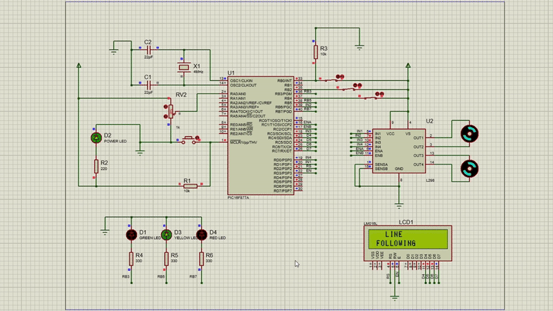

# Line Follower Robot with Obstacle Detection – PIC Assembly Project

This is a college project developed using assembly language for the PIC16F877A microcontroller. The robot is designed to follow a black line using infrared sensors and intelligently avoid obstacles using both digital and analog proximity sensors. An LCD provides real-time feedback on the robot's status.

## 👨‍💻 Author

*Mohammed Ihab*  
College Project – Microprocessors Systems (PIC Assembly)  
Year: 2025

---

## 🚗 Project Overview

The robot performs the following functions:

- *Line Following*  
  Using two *infrared sensors*, the robot detects and follows a line on the ground.

- *Obstacle Avoidance*  
  - A *photoelectric switch (E18-B03N1)* acts as a digital proximity sensor. It triggers an *interrupt* when an obstacle is detected.
  - A *Sharp analog infrared sensor* provides distance-based detection:
    - *Red LED: Obstacle is **very close*
    - *Yellow LED: Obstacle is at **mid-range*
    - *Green LED: Obstacle is at a **safe distance*

- *LCD Display*  
  An *alphanumeric LCD* displays the robot's current status (e.g., "LINE FOLLOWING", "STOP  OBJECT DETECTED", etc.).

---

## ▶ How to Run the Simulation

1. Open simulation/Line_Follower_Sim.pdsprj in Proteus.
2. Load simualation/line_follower_robot.HEX into the PIC16F877A in the schematic.
3. Run the simulation.
4. Interact with the line sensors and proximity sensors to observe the robot’s behavior on the LCD.

---

## 🧠 Notes

- Delays will be affected if 4MHz crystal oscillator is not used.
- The analog sensor range thresholds can be adjusted in the code as desired.
- If nothing appears on the LCD even though the connections are correct, the initial delay in LCD_INIT might need to be increased.

## 🛠 Tools Used

MPLAB IDE v8.92 – for writing and assembling the PIC assembly code

Proteus – for simulating the circuit and testing the robot behavior

## 🧪 Simulation

